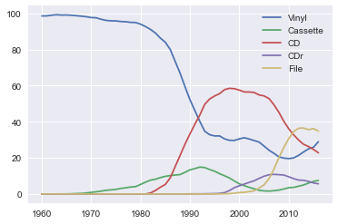
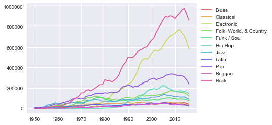
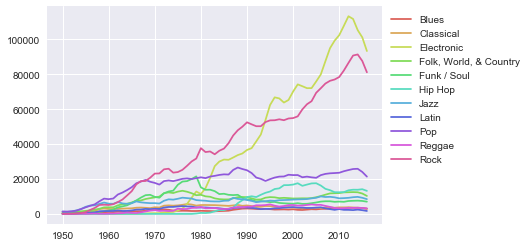
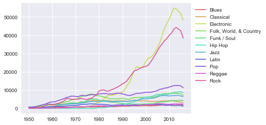

# Examples of analysis of editorial metadata from the Discogs database

## Dataset coverage

### Genre coverage (%)

### Number of releases across years by country

## Average track duration
### Genres
Including releases with multiple genre annotations (in minutes, number of computed tracks is given in brackets):

Excluding releases with multiple genre annotations (in minutes, number of computed tracks is given in brackets):

### Styles (grouped by genre, in minutes) 
The number of computed tracks for each style is given in brackets.

Pop

Rock

Electronic

Blues

Jazz

Classical

Reggae

Hip Hop

Funk / Soul

Latin

Folk, World & Country

### Styles (overall, in minutes)

### Evolution of durations across time (by genre, in minutes)
Pop

Rock

Electronic

Classical

Blues

Jazz

Reggae

Hip Hop

Funk / Soul

Latin

Folk, World & Country

## Release formats
### Overall proportion of released music by format across years (%)
Number of releases

Percentage of releases

Number of tracks

Percentage of tracks

### Formats per genre (% of released tracks)
Blues

Classical

Electronic

Folk, World & Country

Funk / Soul

Hip Hop

Jazz

Latin

Pop

Reggae

Rock

### Formats for some Electronic styles (% of released tracks)
Ambient

Experimental

Synth-pop

Deep House

Dubstep

IDM

Glitch

Techno

Drum n Bass

House

Psy-Trance

## Genre and style trends
### Overall
Number of tracks

Percentage of tracks

Number of releases

Percentage of releases

Number of artists

Percentage of artists

### Electronic genre (styles)
Percentage of tracks

## Genre and style co-occurrences 
### Genres

### Electronic styles
To zoom the image, open it in a separate browser tab, and zoom in.

### Evolution of style co-occurrences (Electronic - House)

